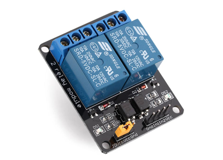

5v Relay Module
================
Python files for controlling a Relay Module boards on theBeaglebone Black

| Board pin name | Board pin | Beaglebone Black pin name |
|----------------|-----------| --------------------------|
| GND            | 1         | P9\_1, Ground             |
| In1            | 2         | P8\_8, GPIO               |
| In2            | 3         | P8\_7, GPIO               |
| In3            | 4         | P8\_10, GPIO              |
| In4            | 5         | P8\_9, GPIO               |
| In5            | 6         | P8\_12, GPIO              |
| In6            | 7         | P8\_11, GPIO              |
| In7            | 8         | P8\_14, GPIO              |
| In8            | 9         | P8\_16, GPIO              |
| In9            | 10        | P8\_15, GPIO              |
| In10           | 11        | P8\_18, GPIO              |
| In11           | 12        | P9\_12, GPIO              |
| In12           | 13        | P9\_15, GPIO              |
| In13           | 14        | P9\_23, GPIO              |
| In14           | 15        | P9\_41, GPIO              |
| In15           | 16        | P9\_27, GPIO              |
| In16           | 15        | P9\_30, GPIO              |
| VCC            | 17        | P9\_3, VDD 3.3v           |

